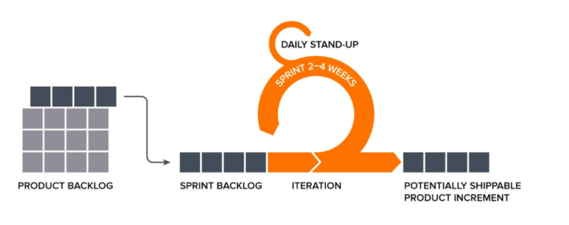
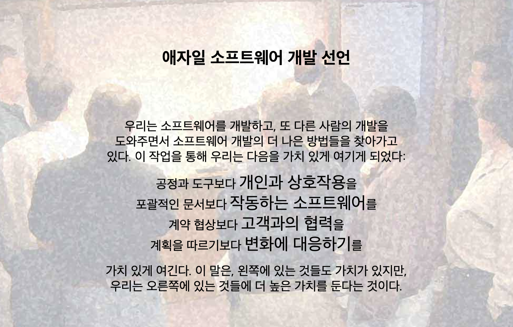
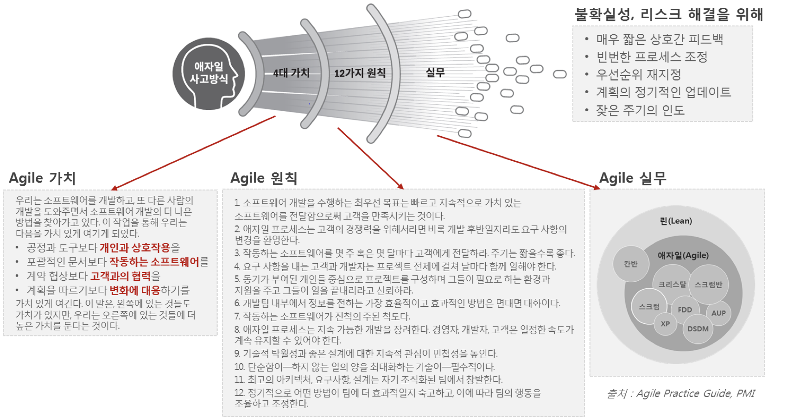
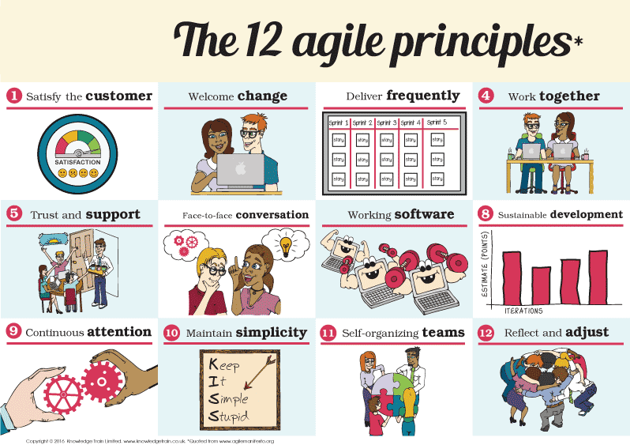

# Agile의 기본 개념

Agile 은 "협력"과 "피드백"을 통해 유연하게 SW개발을 할 수 있게 민첩성(Agility)를 부여하는 개발 방법론을 총칭합니다.

### Agile 정의

* Agile은 기업의 경쟁력을 위하여 변화하는 **<u>비즈니스 환경에 빠르고, 유연하게 대응하기 위한 제품 개발 방법론</u>**
* 기존 방법론들이 가지고 있던 다소 무겁고(Heavyweight) 규범적인 프로세스의 문제점들을 극복하면서 소프트웨어를 좀 더 **<u>가볍고(Lightweight) 효율적으로 개발하는 방법론</u>**

### Agile의 사고방식

Agile은 Agile의 4가지 가치와 이로부터 파생된 12가지 원칙을 준수하는 Agile Mindset으로 정의될 수 있으며, Agile방법론은 Agile Mindset을 기반으로 실행되어야 합니다.

Agile을 실무적으로 수행함에 있어서 Agile Manifesto의 가치와 원칙을 준수하며 이를 훼손하지 않고 올바로 이행하는 것이 Agile의 정착과 지속적인 확산에 매우 중요한 역할을 합니다.

s