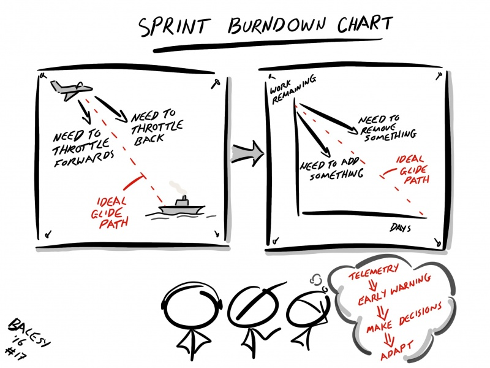

# Burndown Chart

### 개요

Burndown Chart는 남아 있는 일의 양 대비 시간을 표현한 그래프이다.

Burndown Chart는 작업의 진행 상태를 파악하여 일이 완료되는 시점을 예측하는데 유용하게 사용될 수 있다.

### 종류

Burndown Chart는 크게 3가지 종류로 구분된다.

- Sprint Burndown Chart
  - 한 Sprint에 대한 Burndown Chart
- Release Burndown Chart
  - 한 Release에 대한 Burndown Chart
- Project/Product Burndown Chart
  - 전체 프로젝트에 대한 Burndown Chart

### 해석

Burndown Chart의 그래프가,

- 기준선 위로 간다면, 일정이 지연되고 있거나, 너무 과도한 계획을 세웠다는 의미
- 기준선 아래로 간다면, 일이 빨리 해결되고 있거나, 너무 과소한 계획을 세웠다는 의미

### 범위 변경

Sprint 진행중에 범위가 변경된 경우, 변경된 Point 만큼 Chart에 수직선으로 표현된다.

위로 올라가면 범위가 증가된 것이고, 아래로 내려가면 범위가 감소한 것이다. 

### Anti-Patterns

Burndown Chart에서 나타나는 나쁜 징후들을 살펴본다.

- Late Acceptance: PO가 늦게 인수함

- Slow Progress: 예상했던 것보다 작업의 완료가 늦어짐

- Scope Increase: 범위가 변경됨

- Early Finish: 예상했던 것보다 작업이 빨리 끝남

### Velocity Chart

Velocity Chart는 지금까지 진행해온 Sprint 별 팀의 Velocity(완료한 Story Point의 총합)를 표현한 그래프이다.

#### 활용

Velocity Chart는 다음과 같이 활용될 수 있다.

- 향후 Sprint 계획시, 작업량 예측의 근거 자료로 사용
  - 보통의 경우, 지난 3번의 Sprint의 평균값을 팀의 Velocity로 사용
- 계획한 Story Point의 총합과 실제 완료한 Story Point의 총합의 차이와 추이를 확인

#### 샘플

