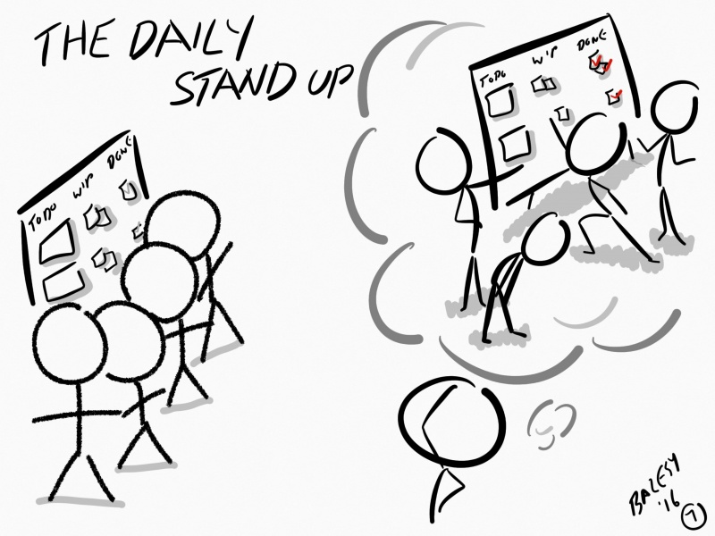

# Daily Scrum

### 개요

Daily Scrum(데일리 스크럼, 혹은 Daily Standup)은 개발팀을 위해 15분으로 시간이 고정된 미팅이다.

Daily Scrum에서는 Sprint 진행 중에 매일 모여서 개발팀이 다음 24시간 동안 해야 할 작업을 계획한다. 이 미팅은 지난 Daily Scrum 모임부터 수행한 작업을 검토하고 다음 Sprint 작업을 예측하여 팀 협업과 성능을 향상하게 된다.

Daily Scrum은 복잡성을 줄이기 위해 매일 같은 시간 같은 장소에서 이루어진다.

개발팀은 Daily Scrum을 통해 Sprint가 목표에 맞게 진행이 되고 있는지, 또 Sprint Backlog에 있는 작업이 잘 완성되고 있는지 검토한다.

Daily Scrum은 개발팀이 Sprint 목표를 달성할 수 있는 확률을 최적화한다. 매일 Daily Scrum을 통해 개발팀은 자기 조직화 팀으로서, Sprint 목표를 달성하기 위해 어떻게 함께 협력할 것이고, 이번 Sprint에서 예상했던 Product Increments를 만들어 낼 수 있을지 알고 있어야 한다.

(그림: Daily Scrum) (출처: http://www.agileme.com.au/wiki/Daily_Scrum)

### 목적

- 목표 공유
  - 팀원들이 서로를 잘 안다고 하더라도 팀의 업무 목표가 잘 전달되지 않으면 진행할 때 비효율적인 부분들이 나타나게 됨
  - 팀은 하나의 목표를 향해 나아가야 함
- 함께 협업
  - 하나의 일을 혼자서 다 하려고만 한다면, 팀은 불필요
  - 즉, 팀으로 일하는 것은 공동의 목표를 달성하기 위해 팀원들이 분배한 각자의 업무를 수행하는 것
  - 협업을 하지 않으면 좋은 성과가 나타나지 못함
- 문제점 공유 및 해결방법 도출
  - 혼자 일하는 것보다 팀으로 일하는 것이 좋은 이유는 누군가 문제에 처해있을때 서로 도와주고 함께 머리를 맞대어 더 나은 방법을 찾을 수 있다는 것
  - 따라서, 팀원들이 서로가 겪고 있는 문제에 대해서 이야기 하지 않으면 비효율적으로 일할 수 밖에 없음
- 팀 정체성 찾기
  - 자주 어울리지 않은 사람들을 모아 만들어진 팀에서 정체성을 찾는 것은 매우 어려운 일
  - 하나의 목표를 향해 함께 일을 하기 위해서는 팀원 사이의 유대감 형성이 매우 중요

Jason Yip은 GIFTS라는 용어로 Daily Scrum의 주요 목적을 설명하고 있다.

- Good start (좋은 시작)
- Improvement (개선): 문제 노출, 기술 및 아이디어 공유
- Focus (집중)
- Team (팀): 협업
- Status (상태): 작업 상태, 이슈 공유

### 일반적인 진행 방식

미팅의 구조(미팅 진행 형식)는 개발팀이 정하며 Sprint 목표를 향한 진전에 초점을 맞춘다면 다양한 방식으로 수행될 수 있다. 일부 개발팀에서는 질문을 사용하고, 일부는 토론을 기반으로 하기도 한다.

일반적으로 다음의 세가지 질문 사항에 대답하는 형식을 사용한다.

- 나는 어제 하루 동안 팀의 Sprint 목표 달성을 위해 무엇을 했는가?
- 나는 오늘 하루 동안 팀의 Sprint 목표 달성을 위해 무엇을 할 것인가?
- 나 혹은 팀이 Sprint 목표 달성을 하는데 방해요소가 있는가?

Daily Scrum의 진행 형식은 팀의 합의에 따라 팀에 적합한 형식을 적용하여 진행할 수 있다.

### 규칙

- 매일, 정해진 시간, 정해진 장소에서 진행한다.
  - 팀원중 일부가 부재중이어도 정해진 시간에 진행
- 팀원 모두가 참석한다.
  - PO도 가급적 참석
- 참가자 모두가 일어서서 진행한다.
  - 보통의 경우 오프라인 보드 앞에 둘러서서 진행
- 팀이 합의한 진행 방식에 따라 진행한다.
  - 일반적인 진행 방식으로 시작하는 것을 권장
- 최대 15분을 넘지 않게 한다.
  - 한 사람당 1~2분 내외
- 팀 외부 사람 누구나 참관이 가능하다.
  - 단, 발언권은 없음 (허락을 얻은 후 발언 가능)

### 참고사항

- 팀장에게 업무 보고하는 형식은 지양한다.
- 원칙적으로 논의를 하기 위한 미팅은 아니다.
  - 추가 논의가 필요한 사항은 미팅이 끝난 후 관련자들끼리 모여 별도의 미팅을 진행한다.
- 팀에 맞는 진행 방법을 팀 스스로가 합의하여 지속적으로 개선한다.

### Anti-Patterns

- 불규칙하게 **비정기적으로 수행**한다.
- 항상 **15분을 초과**한다.
- **업무 보고**를 위한 회의로 진행된다.
- 문제 해결이나 새로운 요구사항 등의 계획에 대해 토론한다.
- 오래도록 진행 상태가 **변경되지 않는 항목들이 방치**된다.
- 한 팀원이 어떤 작업에 대해 어려움을 호소하지만 **아무도 도와주지 않는다**.
- **기록되지 않은 작업**의 진행 상태에 대해 이야기한다.
- 혼자서 **긴 독백**을 하거나, 사소한 모든 문제에 대해서 언급하면서 많은 시간을 소비한다.
- 한 팀원이 진행 상황을 발표하고 있는데 **딴 짓**을 한다.
- 리더/PO/SM이 팀원들에게 **직접 작업을 할당**한다.
- 미팅에서 무슨 얘기를 할지 **준비하지 않고 참가**한다.
- 일부 팀원이 미팅에 늦거나 참석하지 않는다.
- 다른 사람을 **비난**하거나 과도하게 피드백을 한다.
- **너무 많은 팀원**들이 미팅에 참가한다. (10명 이상)
- 팀 외부의 **이해관계자가 참석**하여 관여한다.
- 관리자가 참석하여 **개인별 성과 자료를 수집**하거나, 구체적인 보고를 요청한다.