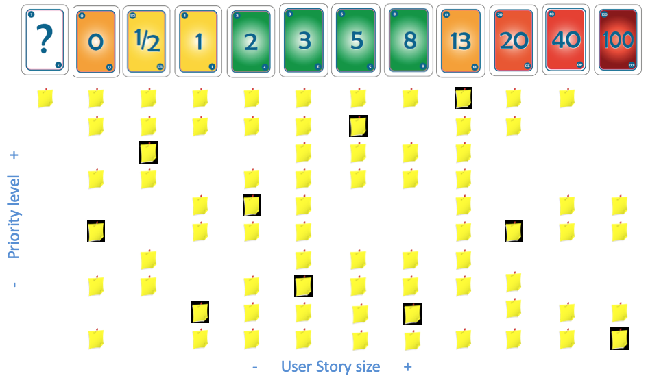

# 추정하기

### 개요

Story 추정은 Story의 작업 크기를 예측하는 것으로, Agile 계획에서 매우 중요한 활동중의 하나이다. 추정은 각 사용자 스토리의 작업의 크기(Size)를 포인트라고 하며, 포인트를 추정하여 정의함으로써 전체 제품 백로그의 크기를 산정한다.

스토리 포인트는 노력(Effort), 복잡도(Complexity), 불확실성(Uncertainty)을 조합하여 판단한다.

- Story 추정은 언제 하나요?
  - 제품 개발 초기의 "릴리즈 계획"에서 주로 수행하지만, Sprint 진행중에도 "Sprint 계획" 등에서도 Product Backlog Grooming을 통해서 지속적으로 수행한다.
- Story 추정은 누가 하나요?
  - 개발팀의 주도로 추정을 한다. PO는 개발팀이 추정을 잘 할 수 있도록 Story에 대한 정보를 제공하고, SM은 이를 촉진하도록 퍼실리테이팅 한다.
- Story 추정은 어떤 단위를 사용하나요?
  - 주로 Story Point나 Ideal Day(이상적 작업일)을 사용한다.
- Story 추정을 하는데 어떤 방법을 사용하나요?
  - 일반적으로 Planning Poker를 사용하지만, Magic Estimation과 같은 좀 더 간단한 방법을 사용하기도 한다.

### T-Shirts Size

XL, L, M, S의 T-Shirts 크기로 러프하게 추정하는 방법이다.

(그림: T-Shirts Size 추정) (출처: https://www.c-sharpcorner.com/article/agile-story-point-estimation-techniques-t-shirt-sizing)

### Planning Poker

Planning Poker는 피보나치 수열과 유사한 숫자들을 크기로 사용하여 추정하는 방법이다.

Planning Poker를 수행하는 방법은 다음과 같다.

- Planning Poker를 준비한다. (실제 카드나, 스마트폰 앱을 활용)
- PO가 개발팀에게 Story를 설명한다.
- 해당 Story에 대해 개발팀이 질문하고 토론한다.
- 개발팀은 각자 생각하는 추정값에 해당하는 카드를 동시에 제시한다.
- 가장 작은 값과 가장 큰 값을 추정한 이유를 설명하고 토론한다.
- 새로운 추정값을 제시하고 차이가 줄어들 때까지 반복
- 3번 정도의 반복으로도 끝나지 않으면 적절한 평균값으로 정한다.

(그림: Planning Poker) (출처:https://www.knowledgehut.com/blog/agile/top-5-scrum-estimation-techniques-find-your-best-fit)

### 추정 보드판

스토리 포인트 추정이 3~4번 반복이 되면 다음 번 추정이 용이하도록 보드를 구성한다. 보드를 보고 유사 제품백로그의 경우 단번에 추정이 가능하게 되거나 비교의 대상이 있기 때문에 보드의 활용이 유용하다

### 일반적인 Planning Poker 카드 해석

| **카드**      | **해석**                                                     |
| ------------- | ------------------------------------------------------------ |
| **1/2**       | 아주 작은 크기의 항목에 사용                                 |
| **1,2,3**     | 작은 크기의 항목에 사용                                      |
| **5,8,13**    | 중간 크기의 항목에 사용. 대부분의 팀이 13을 한 스프린트 안에 포함된 최대치로 사용한다. 13보다 큰 항목은 더 작은 항목 세트로 나눠야 한다. |
| **20,40**     | 큰 항목에 사용                                               |
| **100**       | 아주 큰 제품 기능이거나 Epic                                 |
| **∞(무한대)** | 항목이 너무 커서 숫자를 부여하는 의미가 없다는 것을 나타내기 위해 사용 |
| **?(물음표)** | 팀원이 해당 항목을 이해하지 못해서 제품 책임자에게 추가로 설명을 요청할 경우 사용한다. 일부 팀원들은 자신이 하는 작업과 너무 관계가 없어서 어떻게 추정해야 할지 모르므로, 현재 항목을 추정하는 것에서 사퇴한다는 표시로 사용하기도 한다. |

