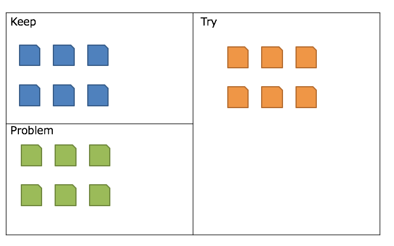

# KPT

### 개요

KPT는 Keep, Problem, Try의 3가지 영역으로 나누어서 생각하도록 진행하는 회고 기법이다.

- Keep: 좋았던 것, 잘한 것, 계속 이어가고 싶은 것 (프로세스, 문화 등)
- Problem: 나빴던 것, 잘 못한 것, 당장 중지해야 할 것 (기술적인 것에서부터 조직 문화에 이르기까지 폭넓게)
- Try: Problem을 해결하거나 개선을 위해 시도해 볼 것 (구체적인 액션아이템)

### 수행 방법

- 위의 그림과 같이 보드를 Keep, Problem, Try의 3개 영역으로 나눕니다. (Try 영역이 더 큰 것에 주목)
- Keep 영역에 대해 논의합니다.
- Problem 영역에 대해 논의합니다.
- Try 영역에서 개선해야 할 사항에 대한 액션아이템을 도출합니다.
- 도출된 액션아이템은 우선순위를 정하여 상위 1~3가지만 실천할 수 있다록 다음 Sprint에 반영합니다.

### 팁

- Keep, Problem, Try의 3가지 영역에 대해 논의할 때, 영역이 서로 섞이지 않게 순서대로 한 영역을 완전히 마무리 한 다음에 다음 영역을 진행합니다.
- Try는 실천 가능할 정도로 구체적으로 도출합니다.
- 너무 많은 액션아이템을 실천하려고 욕심부리지 않습니다. 

