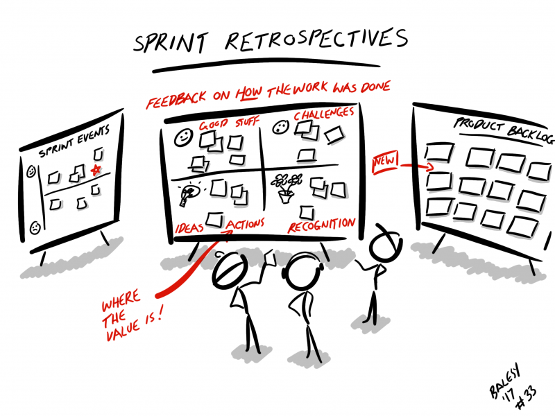

# Sprint 회고하기

### INTRO.

Sprint Retrospective(스프린트 회고) 미팅은 Scrum 팀이 자신을 스스로 되돌아보고 다음 Sprint 동안 무엇을 개선할 수 있을지 계획할 기회를 제공한다.

Sprint Retrospective 미팅은 Sprint Review 미팅 후 그리고 다음 Sprint Planning 미팅 전에 수행된다.

이 미팅은 1개월 Sprint를 기준으로 최대 3시간을 제안한다. 더 짧은 Sprint일 경우에 더 짧은 Sprint Retrospective 미팅을 한다.

SM은 팀이 Sprint Retrospective 미팅을 했는지, 모든 참석자가 그 목적을 제대로 이해했는지 확인해야 하고, 미팅이 긍정적이고 생산적으로 진행되도록 유지해야 하며, 미팅이 주어진 시간 안에 끝나도록 Scrum 팀을 교육해야 한다.

SM은 Scrum 프로세스에 대한 책임을 가지고 개발팀의 동료 멤버로써 미팅에 참여한다.

SM은 Scrum 팀이 Scrum 프로세스 프레임워크 안에서 개발 프로세스와 실천방법이 다음 Sprint에 좀 더 효과적이고 즐겁게 수행할 수 있도록 개선하는 것을 장려한다.

각 Sprint Retrospective 미팅에서 Scrum 팀은 제품 또한 조직 내 표준에 어긋나지 않는 한도에서 필요에 따라 작업 과정들을 개선하거나 완료의 정의를 조정함으로써 제품 품질을 높일 방법들을 계획한다.

Sprint Retrospective 미팅이 끝날 무렵, Scrum 팀은 다음 Sprint에 실천할 개선 사항들을 확인해야 한다. 이러한 개선 사항들을 다음 Sprint에서 실천하는 것이 바로 Scrum 팀 자체를 검토하고 개선되는 방향으로 팀을 조정하는 것이다.

비록 개선은 언제든지 이루어질 수 있지만, Sprint Retrospective 미팅이 검토와 적응에 집중할 수 있는 공식적인 기회를 제공한다.

|   참가자    |               타임박스                |                          산출물                          |
| :---------: | :-----------------------------------: | :------------------------------------------------------: |
| **팀 전원** | **1시간 30분** (2주 Sprint 기준) | **프로세스 개선안** **팀 규칙 (Working Agreement)** |

### STEPS

#### STEP 1: 체크인

- 회고 진행 절차와 시간, 방식, 규칙에 대해 간략히 소개합니다.
- 다양한 체크인 방법을 활용하여 체크인을 수행합니다.

#### STEP 2: 이전 회고 개선안 진행 상태 확인

- 이전 Sprint 회고에서 수행하기로 했던 개선안이 어떻게 진행되고 있는지 확인합니다.
- 잘 되고 있는 것은 무엇인지, 잘 안되고 있는 것은 무엇인지, 잘 안되고 있는 것은 왜 잘 안되고 있는 건지 논의합니다.

#### STEP 3: 회고 주제 설정 (선택사항)

- 특별히 다루고 싶은 주제가 있다면, 회고의 주제로 설정합니다.
- 팀 건강검진을 측정했다면, 그 결과를 회고의 주제로 설정할 수도 있습니다.

#### STEP 4: 팀 규칙 정제 (선택사항)

- 현재의 팀 규칙을 살펴보고 논의하여 갱신합니다.
- 회고 수행시 지켜야 할 규칙도 팀 규칙에 포함시킵니다.

#### STEP 5: 데이터 수집

- 다양한 데이터 수집 방법을 활용하여 객관적, 주관적 데이터를 도출하고 공유합니다.

#### STEP 6: 통찰 이끌어내기

- 수집된 데이터에서 다양한 Voting 방법을 활용하여 집중적으로 논의할 주제를 선정합니다.
- 다양한 기법을 활용하여 선택된 주제에 대해 논의하고 개선안을 도출합니다.

#### STEP 7: 개선안 결정

- 개선안 중에서 투표를 통하여 우선순위가 높은 상위 1~3개를 선정합니다.
- 선정된 개선안은 다음 Sprint에서 수행될 수 있도록 반영합니다.
  - Product Backlog 혹은 팀 규칙에 추가

#### STEP 8: 회고 마무리

- 회고의 결과를 정리합니다.
- 회고 진행 방식을 개선하기 위해 간략하게 회고의 회고를 수행합니다. (선택사항)

### PROTIP

- 회고는 팀원 모두가 솔직한 대화를 할 수 있는 분위기(심리적 안전)가 조성되어야 합니다.
- 개선안은 실천 가능할 정도로 구체적이어야 합니다.
- 선택된 개선안은 차기 Sprint부터 수행될 수 있도록 보장해야 합니다.
- 한 Sprint에는 최소 1개 이상의 회고 개선안을 포함하여 수행해야 합니다. (최대 3개는 넘지 않도록 함)
- 과제 진행상황 공유 회의와 회고는 분리해서 진행해야 합니다.
- 회고 진행시, 진행자는 되도록 말을 줄이고 팀원들이 많은 얘기를 할 수 있도록 유도합니다.
- 회고 진행시, 한 사람씩 말해보세요~ 하면 부담스러워 말을 잘 못할 수도 있으니, 일정 시간을 주고 카드에 적게 하면 참여가 더 용이해 집니다.
- 이번 회고에서 나온 의견 중, 선정되지 못한 것들은 다음 회고에서 활용할 수 있습니다.
- 지난 회고에서 정해진 개선안이 잘 수행되었는지 이번 회고에서 확인해야 합니다.
- 팀 건강검진은 정기적으로 수행하고, 과거 결과와 함께 추세를 파악할 수 있도록 게시합니다.
- 여러 회고 기법들을 참고하여 다양하게 시도해 봅니다.

### REFERENCE

- 회고 기법
  - **[PMI](./pmi.md)**
  - **[KPT](./kpt.md)**

