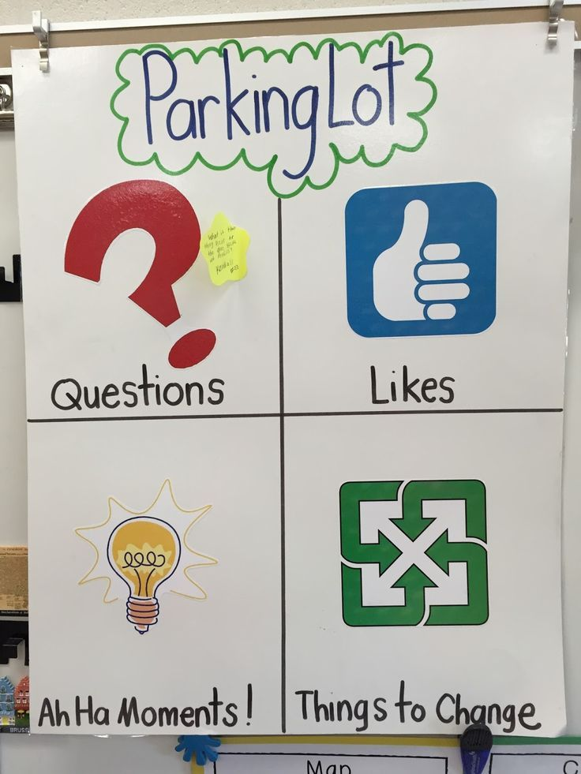

# Parking Lot

### 개요

Parking Lot은 잠깐 주차해 두는 곳이라는 주차장의 개념을 이용하여 잠깐 넣어 두었다가 나중에 꺼내보는 용도로 사용되는 도구이다.

Parking Lot은 다음과 같은 용도로 사용될 수 있다.

- 주제와 관련이 없는 중요한 의견을 붙여두고 나중에 살펴본다.
- 궁금한 사항들을 붙여두고 나중에 살펴본다.
- 좋은 아이디어가 생각 났을때 붙여두고 나중에 살펴본다.
- 이슈 및 개선사항을 붙여두고 나중에 살펴본다.
- 기타 등등

(그림: Parking Lot)