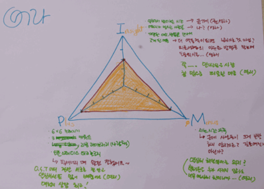

# PMI

### 개요

PMI 회고는 좋았던 점 (Plus), 아쉬웠던점 (Minus), 인상적이었던 점 (Impressive) 의세가지 항목을 중심으로 회고하는 방법입니다. 이 회고는 일반적으로 모든 프로그램이 끝난 후에 마지막회고의 방법으로 이용하는데 각 프로그램이 끝날 때마다 진행해도 됩니다

### 수행방법

- 각자 PMI 회고 양식을 그리게 합니다.
- 정삼각형을 그리고 각 모서리에 P(plus), M(Minus), I(Insight)를 표시합니다. 
- 모서리와 중앙점을 잇는 선을 그립니다. 
- 선 위에 4개의 눈금을 균등하게 표시합니다. 가운데서부터 0, 1, 2, 3, 4, 5(모서리)점이라고 이야기해줍니다. 
- 밖으로 나갈수록 좋았던 점, 아쉬웠던 점, 인상 깊었던 점이 크다고 생각하고 눈금 위에 자신의 점수를 체크합니다. (아쉬웠던 점이 별로 없다면 점수가 낮습니다.)
- 각 점수를서로 선으로 잇고 면에 색칠을 합니다. 
- 이제 각각의 모서리에 자신의 회고 내용을 씁니다. 
- 다 쓴 후에는 자신이 회고한 내용을 발표합니다.

### 팁

- 아쉬웠던 점을 쓸 때 사람들이 주저합니다. 아쉬웠던 점, 즉 Minus는 비판이 아니라 개선을 위한 제안이라는 점을 명확히 해야 합니다. 
- 각자 쓴 PMI회고를 서로 돌려보면서 다른 사람의 생각을 확인하고, 자신의 생각을 덧붙일 수도 있습니다