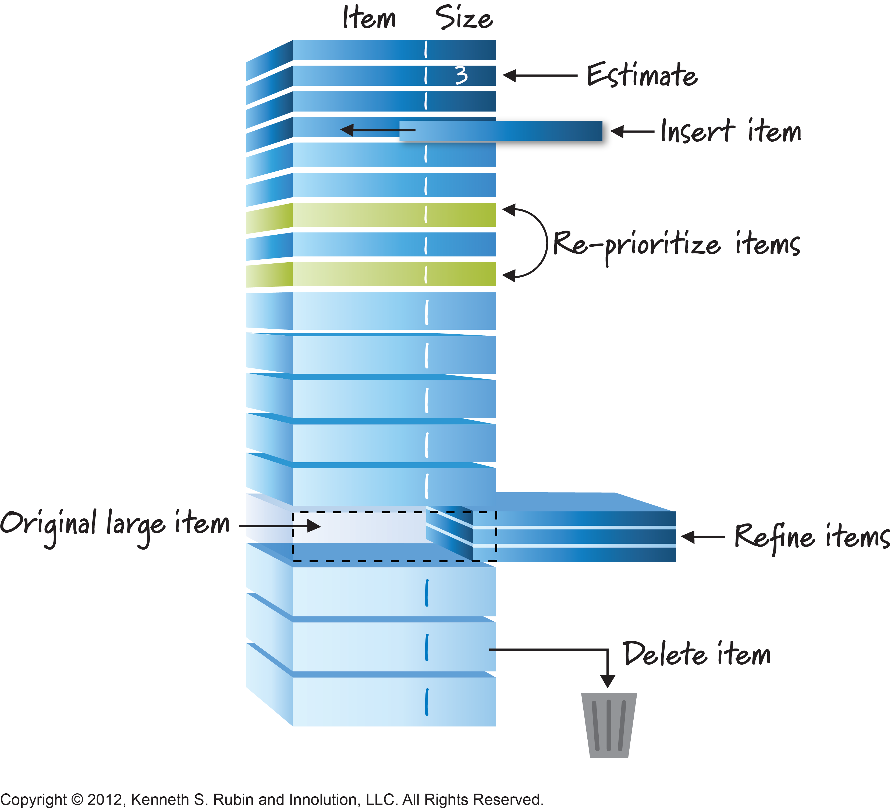

# Product Backlog

### 개요

Product Backlog는 제품에 필요하다고 알려진 모든 요구사항에 대한 우선순위화 된 목록이며, 제품에 대한 모든 변경 요구사항을 포함하는 단 하나의 소스이다.

PO가 Product Backlog의 내용 및 우선순위화에 대한 책임을 갖고 있다.

Product Backlog는 요구사항에 대한 완성본이 아니고, 제품으로 진화하고, 그 제품이 사용될 환경과 함께 진화하면서 끊임없이 변화한다.

Product Backlog는 제품의 다음 배포에 추가로 포함될 모든 기능/비기능 요구사항, 개선사항 등을 나열한다.

Product Backlog 항목들은 각각에 대한 설명, 우선순위, 추정값 등이 포함되는데, 그것이 “완료”되었을 때 완료되었음을 증명해 줄 테스트(인수기준)에 대한 설명을 포함하고 있다.

여러 Scrum 팀들이 같은 제품을 만들기 위해 함께 일하고, 그 제품을 만들기 위해 해야 할 작업을 설명하는데 단 하나의 Product Backlog가 사용된다.

어떤 Product Backlog 특성이 항목들을 그룹화하는데 사용될 수 있다.

### Product Backlog Grooming

Product Backlog Grooming은 Product Backlog 항목들에 대한 상세한 내용, 작업의 크기, 그리고 우선순위를 추가하는 활동이다.

이는 PO와 개발팀이 Product Backlog 항목들을 상세화하기 위해 협력하는 지속적인 과정이다.

Product Backlog Grooming 중에, 각 항목을 검토하고 수정한다. Scrum 팀은 언제 어떻게 Product Backlog Grooming 작업을 완료할지 결정한다. 이 작업을 위해서 보통 개발팀 전체 가용 시간의 10% 미만을 사용한다. 하지만, Product Backlog 항목들은 PO의 재량에 따라 언제든지 업데이트 될 수 있다.

높은 순위의 Product Backlog 항목들이 일반적으로 낮은 순위의 항목들 보다 좀 더 명확하게 상세하다. Product Backlog 항목이 더 명확하고 상세할수록 더 정확한 개발 견적을 얻을 수 있고, 낮은 순위의 Product Backlog 일수록 상세화가 덜 되어 있다.

다음 Sprint를 위해 개발팀에 할당될 Product Backlog 항목들은 각 항목이 Sprint 기간 내에 합리적으로 “완료”될 수 있도록 다듬어진다. 한 Sprint 내에 개발팀에 의해 “완료”될 수 있는 Product Backlog 들은 Sprint Planning에서 선택할 수 있는 “준비”된 항목들로 여겨진다. Product Backlog 항목들은 일반적으로 위에 기술된 상세화 단계들을 통해 “준비”된 항목으로서의 투명성을 얻게 된다.

### 진행 상황 모니터링

전체 개발 목표에 도달하기 위해 남은 총 작업량은 언제든지 계산될 수 있다. PO는 적어도 Sprint Review 마다 남아 있는 총 작업량을 추적한다. PO는 목표로 한 날짜까지 작업을 완료하도록 진행 상황을 평가하기 위해 남아 있는 총 작업량을 이전 Sprint Review에서 남아 있던 작업량과 비교한다. 이러한 정보는 제품과 관련된 모든 이해관계자에게 투명하게 공개된다.

Burndown Chart나 Burnup Chart와 같은 다양한 트렌드 분석 예상 도구들이 진행 상황을 예측하기 위해 사용된다. 이러한 도구들이 유용하다고 알려져 있지만 경험주의 이론의 중요성을 대체하지는 못한다. 복잡한 환경에서는 무슨 일이 발생할지 알 수 없다. 단지 지금까지 이미 발생했던 일이 앞으로 의사 결정을 하는데 사용될 수 있다.

### Product Backlog 항목의 종류

Product Backlog에 들어갈 수 있는 항목은 다음과 같은 것들이 될 수 있다.

- Feature(기능): 새로운 기능, 기능 개선
- Defects(결함): 버그 등
- Technical Work(기술적 작업): 고객에게 직접적인 가치를 제공하지는 못하지만 필요한 기술적인 작업 (리팩토링 등)
- Knowledge Acquisition(지식 습득): 새로운 UI 프로토타이핑, 새로운 기술 실험 등

분류가 명확하지 않고 여러 분류에 걸치는 항목들이 존재할 수 있다. 항목들을 분류하여 관리할 필요는 없지만, 이런 분류에 속하는 것이라는 것을 인지할 필요는 있다.

### Reference

- **[Product Backlog Template](http://moudemo.mousoft.co.kr/confluence/display/AW/Product+Backlog+Template)** ==> 템플릿 링크 필요