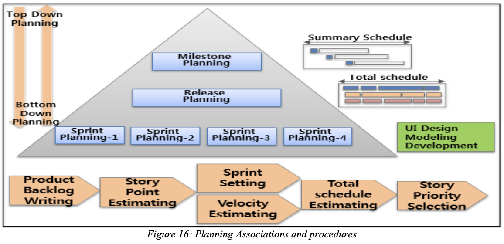

# 프로젝트 계획 수립

프로젝트 마일스톤 및 일정 수립 등 각종 계획 수립 및 승인을 받으며 최종적으로 프로젝트 추진 계획서를 승인 받아야 합니다.

### 1. Agile 프로젝트 계획 수립 원칙

   * 개략적인 범위(요구사항)와 일정을 기준으로 초기 프로젝트 추진 계획을 수립하고, 주기적으로 상세 요구사항 도출(제품 백로그, 스프린트 백로그 등) 및 계획을 수립하여 반영함
   * Agile은 유동적인 범위, 일정, 비용이 발생함을 인정함
### 2. 프로젝트 추진 계획서 작성

* 추진개요 : 프로젝트 명, 설명, 목적, 추진 배경, 기간, 주요 개발 내용, 기대효과 등 간략한 프로젝트 개요 작성
* 범위관리 : 과업내역서 등을 참조해서 프로젝트 초기 범위를 정의하고, 범위 검증 및 통제하는 방법을 기술
  - 제품 백로그에 전체 과업에 대한 범위를 기술하여야 하며, 우선 순위에 따라 점진적으로 상세화 함
* 일정관리 : 과업 내역서 등을 참조하여 프로젝트 전체 일정을 수립한 후, 주기적으로 상세 일정 계획을 수립
  * 마일스톤 계획 : 프로젝트의 주요 단계와 업무, 이벤트 등을 표시한 요약 일정
  * 릴리스 계획 : 프로젝트에서 수행할  제품 백로그를 표현한 전체 일정 계획
  * 스프린트 계획 : 2~4주 단위로 개발팀이 실제 수행하는 작업들로 구성된 상세 계획

* 마일스톤 계획은 릴리스 계획의 요약이라고 할 수 있으며 릴리스 계획은 여러 개의 스프린트 계획으로 구성되어 있지만 스프린트 계획은 미리 수립하지 않고 해당 시점에 수립 가능
* WBS는 프로젝트 특성에 따라 작성하지 않고 다른 산출물로 대체도 가능(제품백로그, 릴리스 계획서, 스프린트 계획서 등) WBS 작성시에는 보안성 검토, 릴리스 일정 등 프로젝트의 주요 이벤트 중심으로 작성
* 인적 자원 관리 : 수립된 일정 계획 및 수행 Task를 기반으로 조직도, 역할과 책임, 단계별 인력 투입 계획 등을 작성함
  * 역할과 담당 업무 : 프로젝트 완료에 필요한 역할과 담당 업무를 기술
  * 프로젝트 조직도 : 프로젝트 팀원과 그들 사이 보고 체계를 보여주는 도표
  * 팀원 관리 계획서 : 팀원을 확보할 시기와 방법, 팀원이 필요한 기간을 기술
  * 만약 협력 업체가 용역을 수행할 경우에는 협력 업체 인원의 이력서, 재직 증명, 자격, 학력 및 증빙성류 등을 검토하여 투입 인력의 적절성을 확인하여야 함
  * 협력 업체 투입 인력 뿐만 아니라 사내 투입 인력에 대한 역할과 책임, 투입 공수를 명확히 정의하여야 함
  * PM은 프로젝트에 필요 기술을 도출하여 투입 인력에게 필요한 기술 교육을 도출하고 교육 계획을 식별함
* 의사 소통 계획 : 프로젝트 주요 의사 소통 대상으로 프로젝트에 영향을 미치는 피로젝트 내/외 관련 그룹을 식별함
  * 프로젝트 내부 : 프로젝트 팀원 간의 원활한 의사 소통을 위한 정기회의 시기, 의사 소통 체계, 도구 등을 명시
  * 프로젝트 외부 : 프로젝트 외부 이해 당상자와의 의사 소통을 위한 회의 시기, 주기, 방법 등을 명시

** 프로젝트 특성에 따라 추진 계획서에 이해관계자 관리, 리스크/이슈 관리, 형상 관리, 품질 관리, 동료 검토 계획 등이 포함되어 작성 될 수 있음

### 3. 프로젝트 추진 계획서 승인

* PM은 제품 책임자에게 프로젝트 추진 계획서의 승인을 요청하여 승인을 받아 계획를 확정
  * 프로젝트 실행 및 지원의 직접적인 책임이 있는 이해 관계자로부터 Commiment를 확보함