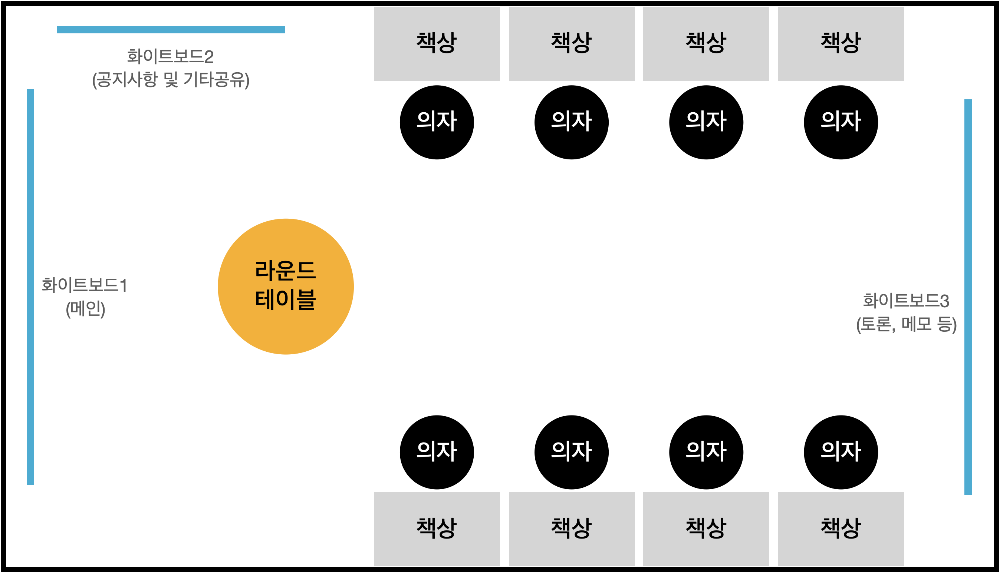

# 프로젝트 착수 준비

### 개요

사업 수행을 위한 사전 영업, 제안, 계약 활동 수행 결과를 기반으로 프로젝트 진행 시 수행하여야 할 활동을 계획, 검토하여 제품 책임자의 승인을 받는 프로세스입니다.

1.  프로젝트 준비
    * PM은 프로젝트 시작을 위한 각종 업무 환경을 준비
      * 협력 사원 출입증 발급 및 보안 각서 작성
      * 투입 인력 ID 발급(KT 프로젝트의 경우 IDMS), 각종 필요 시스템 사용자 등록 신청
    * 작업 환경 설정
      * 작업 기기 설치(노트북, 프린터, 상면 등), IP 발급
      * 고객사 보안 S/W 설치 등(kt 프로젝트의 경우 PC-DRM, DLP 등)
      * 개발팀 보안 교육 및 Agile 기본 교육 실시
      * 고객사 보안 정책 설명, 사외 메신저 사용 금지, 고객사가 제공하지 않는 무선 네트워크 사용 금지 등

(그림: Agile 프로젝트 개발실 배칙도 예시)

