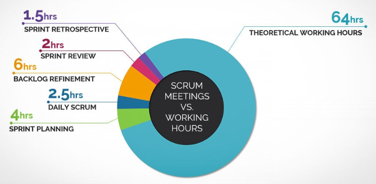

# Scrum 이벤트

### 개요

Scrum은 정해진 이벤트 미팅을 정기적으로 가짐으로써 Scrum에 정의되지 않은 다른 미팅을 최소화한다.

Scrum의 공식적인 이벤트는 아래의 5가지로 이루어져 있다.

- [**Sprint**](./sprint.md)
- [**Sprint Planning**](./sprint-planning.md)
- [**Daily Scrum**](./daily-standup-meeting.md)
- [**Sprint Review**](./sprint-review.md)
- [**Sprint Retrospective**](./sprint-retro.md)

### Time-Box

모든 Scrum 이벤트 미팅은 정해진 시간(Time-Box) 안에 끝내야 하며, 각 이벤트는 최대 소요시간이 정해져 있다.

(그림: Sprint 2주 기준 Scrum 이벤트의 Time-Box)

일단 Sprint가 시작되면, 그 소요 시간은 고정되어 줄어들거나 늘어날 수 없다.

Scrum 이벤트 미팅의 목적이 달성되면 정해진 시간 전에 미팅을 끝낼 수 있다. 단, 프로세스 내에 시간 낭비 없이 충분한 시간이 사용되었음을 보장해야 한다.

### 검토와 적응

Sprint 내에 포함된 각각의 이벤트들은 무엇인가를 검토하고 적응하기 위한 공식적인 기회이다.

이 이벤트들은 투명성, 검토 및 적응을 할 수 있도록 설계되었다. 이들 중 하나라도 빠진다면, 투명성이 감소하고 검토와 적응할 기회를 잃게 된다.

