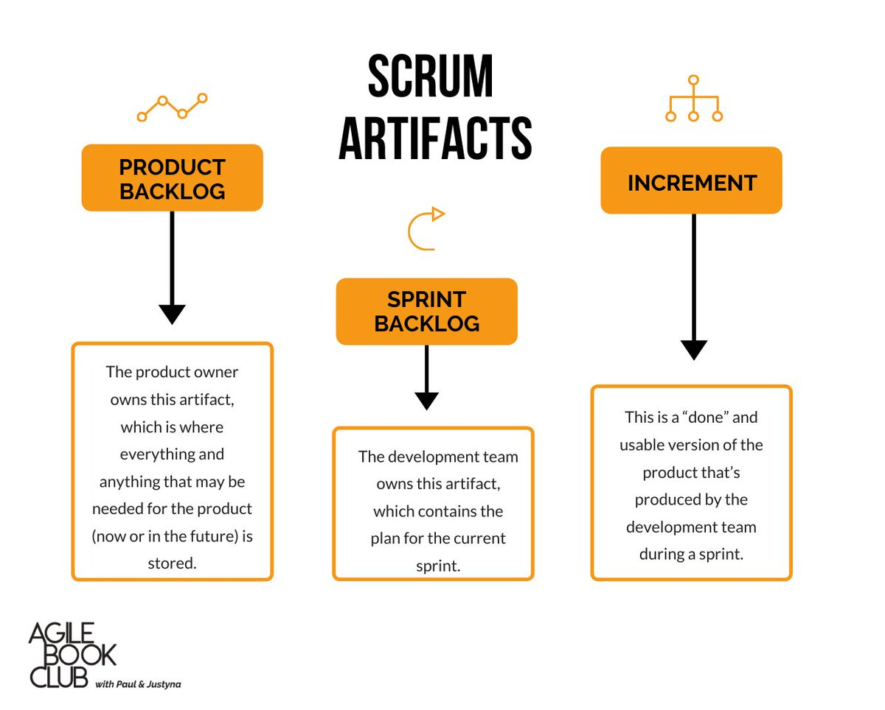

# Scrum 산출물

### 개요

Scrum 산출물은 다른 방법론과 달리 제품 개발에 필요한 최소한의 산출물만을 정의하고 있다.

Scrum 산출물은 다음 3가지로 구성된다.

- **[Product Backlog](./product-backlog.md)** (제품 백로그): 제품 개발을 하기 위한 요구사항 정의
- **[Sprint Backlog](./sprint-backlog.md)** (스프린트 백로그): Sprint 진행을 위한 요구사항
- **[Product Increments](./product-increments.md)** (제품 증분): Sprint 진행을 통해 실제 고객에게 인수 가능한 실행 가능한 제품 또는 제품 일부분

(그림 Scrum 산출물)(출처:https://twitter.com/AgileClub/status/1236941804223836160/photo/1)

Product Backlog는 PO에게, Sprint Backlog는 개발팀에게 관리 책임이 있고, Product Increments는 팀원 모두에게 책임이 있다