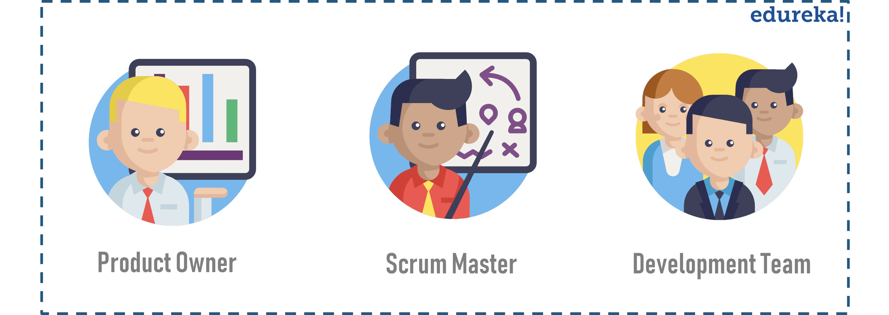

# Scrum 역할

### Scrum 팀 구성

Scrum 팀은 Product Owner, Development Team 그리고 Scrum Master의 3가지 역할로 구성된다.

특정 기술 영역에 대해서는 전문 담당자의 기술 지원을 받을 수 있다. 또한, Agile 도입 초기 시점에는 외부 Agile Coach의 지원을 통하여 Scrum 팀의 올바른 Agile 이행을 지원한다.

- [**Product Owner**](./product-owner.md)
  - PO는 제품의 최종 책임자로써, 제품이 고객에게 제공하는 가치를 극대화 할 책임을 가진다.
    - 제품 비전 및 목표 제시 (제품, 릴리즈, Sprint)
    - Product Backlog 관리 (우선순위화, 가시화, 지속적 정제)
    - User Story 작성 (Who, What, Why, 인수조건)
    - Story 인수 승인 및 거부 (피드백)
- [**Development Team**](./development-team.md)
  - 개발팀은 제품을 만드는 전문가로써, 올바른 제품을 만들 책임을 가진다.
    - Sprint 계획에서 약속한 목표를 달성하기 위해 노력
    - 목표 달성을 위해 필요한 일들을 개발팀 스스로 협의하여 결정 (자기 조직화)
    - 제품의 가치 실현을 위해 필요한 최상의 방법을 결정하여 수행
    - 개인의 이익보다는 팀을 위해 헌신
    - 생산성과 품질 향상을 위한 기술적 실천법(Engineering Practice) 적용
- [**Scrum Master**](./scrum-master.md)
  - SM은 Scrum의 추진자로써, 팀 전체를 지원하고 관리 할 책임을 가진다.
    - Scrum 이론, 실천법, 이벤트 촉진 (Facilitator)
    - PO 역할을 이해하고 수행할 수 있도록 지원
    - 개발팀의 자기 조직화를 지원하고, 장애물 제거 (Servant Leader, Coach, Mentor)
    - 조직의 생산성 향상을 위해 다른 SM과 협력하여 변화 추진 (Change Agent)

### Scrum 팀 크기

일반적으로 Scrum 팀은 7+-2(5~9)명의 크기로 구성된다. 그 이상인 경우에는 팀을 분할하는 것을 고려해야 한다. 

### Scrum 팀 특징

Scrum 팀은 다음과 같은 특징을 가지고 있다.

- 자기 조직적 (Self-Organizing)
  - Scrum 팀은 외부의 누군가에 의해 지시 당하기보다는 팀의 작업을 어떻게 하면 최상으로 수행할지 스스로 선택
- 교차 기능적 (Cross-Functional)
  - Scrum 팀은 팀 외부의 누군가에 의지하지 않고 자신들의 작업을 수행하는데 필요한 모든 주요 역량 보유

이러한 Scrum 팀의 모습은 유연성(Flexibility), 창의성(Creativity), 생산성(Productivity)을 최적화하기 위해 설계되었다.

### Scrum 팀 업무 환경

Scrum 팀이 최고의 효율을 낼 수 있도록 아래와 같은 업무 환경이 지원되어야 한다.

- 팀룸: 팀원들이 모두 한 공간에 모여 있는 War Room 스타일의 개방된 업무 공간
- 공간: 벽, 화이트보드 등의 정보를 게시할 수 있는 충분한 공간
- 도구: 개인 사무기기, 프로젝트 관리 협업 도구 등 최고의 도구

### kt/kt ds 에서의 Scrum 역할

| 역할                                  | 참여자(예시)                       | 설명                                                         |
| ------------------------------------- | ---------------------------------- | ------------------------------------------------------------ |
| **제품책임자** (Product Owner)   | 고객사 (kt 사업부서 및 BA)    | **제품책임자는 사업에 대한 책임을 가진 고객 직원이 수행 **- 프로젝트 범위, 일정, 예산 등의 상호 연관성에 대한 조정 역할 - 제품 백로그 관리(구체화, 보완, 우선순위 결정 등) - 다음 스프린트에 어떤 것이 우선적으로 진행 하는지 결정 - 지속적으로 제품백로그 우선순위와 아이템 개선 - 고객 및 모든 이해관계자들과의 소통과 협업 |
| **스크럼 마스터** (Scrum Master) | kt ds (별도 인력 or kt ds PM) | **제품 책임자와 개발팀 사이의 Focal Point **- 완성된 제품을 주기적으로 제품책임자에게 제공할 책임 - 프로젝트 이해관계자에 진행 사항 보고, kt와의 관계형성, 외부 인사나 압력으로부터 보호 - 회사간 계약으로 인해 발생하는 Resource(인력, 상면 등) 이슈 해결 |
| **개발팀** (Dev. Team)           | kt ds (프로젝트팀, 협력사)    | **제품 백로그에 있는 요구사항을 스프린트를 통해 구현하는 역할 **- 고객의 요구를 충족시키는 동작하는 소프트웨어를 만드는 활동을 수행 - 자기조직화/교차기능적 팀 구성을 위한 전문가로 구성되어야 하며, 지속적으로 속도 측정이 되어야 함 - 개발팀의 생산성 극대화를 위해 가급적 팀 구성원은 유지(DevOps 연계) - UI/UX, 분석가, 개발자, 아키텍처, QA, 테스터 등으로 개발팀 구성 |
| **전사 Agile 코치 그룹**         | kt ds (전사 조직)             | **개발팀이 원활하게 활동할 수 있도록 도와주는 역할 **- 스크럼 이벤트들의 퍼실리테이팅과 각종 스크럼 산출물 작성에 도움 - Agile이 익숙하지 않은 팀에게 스크럼 교육 지원 |

### Scrum Master vs. PM

| **구분** | **Project Manager**                                          | **공통사항**                                                 | **Scrum Master**                                             |
| -------- | ------------------------------------------------------------ | ------------------------------------------------------------ | ------------------------------------------------------------ |
| **역할** | 프로젝트에 대한 총괄 책임을 갖는다. 개발 팀원들에게 명령과 통제를 통하여 업무를 할당한다. 프로젝트의 모든 중요 의사결정을 수행한다. 팀원 확보 및 팀 구성 | 개발 과정에서 발생하는 이슈 및 리스크 관리 이해관계자들을 의사 소통하며 업무를 조율 요구사항 변경 통제 이해관계자 관리 프로젝트 계획 및 모니터링 기타 프로젝트 관리 업무 | 프로젝트에 대한 총괄 책임은 개발팀과 분산해서 갖는다. 개발 팀원들이 자발적으로 업무를 수행할 수 있는 환경을 조성한다. 프로젝트의 중요 의사결정은 팀과 협의해서 결정한다. 팀원들의 사기 및 워크로드를 관리한다. 지속적인 프로세스 개선 |

