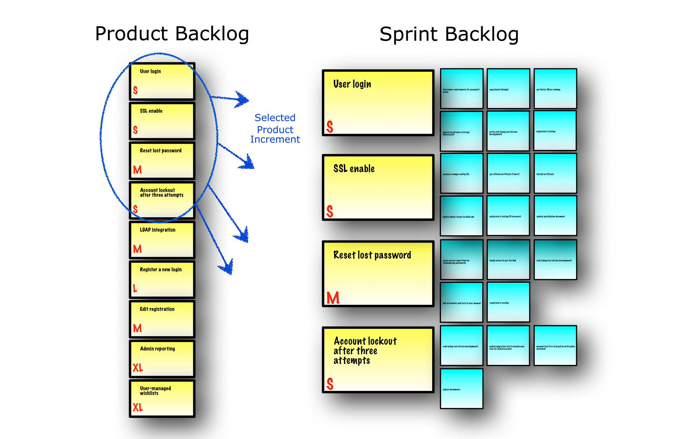

# Sprint Backlog

### 개요

Sprint Backlog는 Sprint를 위해 선택된 Product Backlog 항목들의 집합이며 Sprint 목표를 실현하기 위한 계획서이다.

Sprint Backlog는 무슨 기능이 다음 Product Increments에 포함될지, 그 기능을 “완료”된 Product Increments로 배포하는데 필요한 작업이 무엇인지를 개발팀이 예상한 작업 목록이다.

Sprint Backlog는 개발팀이 Sprint 목표를 달성하는데 필요한 모든 작업을 투명하게 보이도록 한다. 지속적인 개선을 하기 위해 Sprint Backlog에 이전 Sprint Retrospective 미팅에서 나온 첫 우선순위의 프로세스 개선 항목을 최소 하나 이상 포함한다.

Sprint Backlog는 그 진행 상황을 Daily Scrum 미팅에서 이해할 수 있을 만큼 충분히 상세화된 계획서이다. 개발팀은 Sprint가 진행되는 동안 Sprint Backlog를 수정하고 추가적인 항목들을 만들 수 있다. 개발팀의 작업이 계획대로 진행되고 Sprint 목표 달성에 필요한 작업을 더 많이 알게 되면서 이러한 Sprint Backlog 항목들을 추가할 수 있다.

새로운 작업이 필요하다면 개발팀은 그것을 Sprint Backlog에 추가한다. 이 작업이 수행되거나 “완료”됨에 따라 남아 있는 작업량의 추정치를 업데이트 한다.

계획한 항목 중에 불필요한 것으로 판단된 것들은 제거한다. 단지 개발팀만이 Sprint 동안에 Sprint Backlog를 변경할 수 있다.

Sprint Backlog는 높은 가시성을 제공하고, Sprint에서 “완료”될 작업에 대해 실시간으로 진행 상황을 보여주며, Sprint Backlog는 오로지 개발팀만이 소유한다.

### Sprint 진행 상황 모니터링

Sprint 진행 중에 언제든지 남아 있는 Sprint Backlog의 총 작업량을 알 수 있다. 개발팀은 최소한 매일 진행되는 Daily Scrum 미팅에서 Sprint 목표를 달성하기 위해 남아 있는 총 작업량을 추적해야 한다.

Sprint를 진행하면서 남은 작업량을 추적함으로써 개발팀은 전체 진행 상황을 관리할 수 있다.

### Sprint Backlog 항목

Sprint Backlog는 해당 Sprint에서 구현할 Story와 이를 구현하기 위해 필요한 세부 Task로 구성된다.

- Story: Story Point 단위
- Task: 시간 단위 (선택사항)

### Reference

- **[Sprint Backlog Template](http://moudemo.mousoft.co.kr/confluence/display/AW/Sprint+Backlog+Template)**  ==> template 