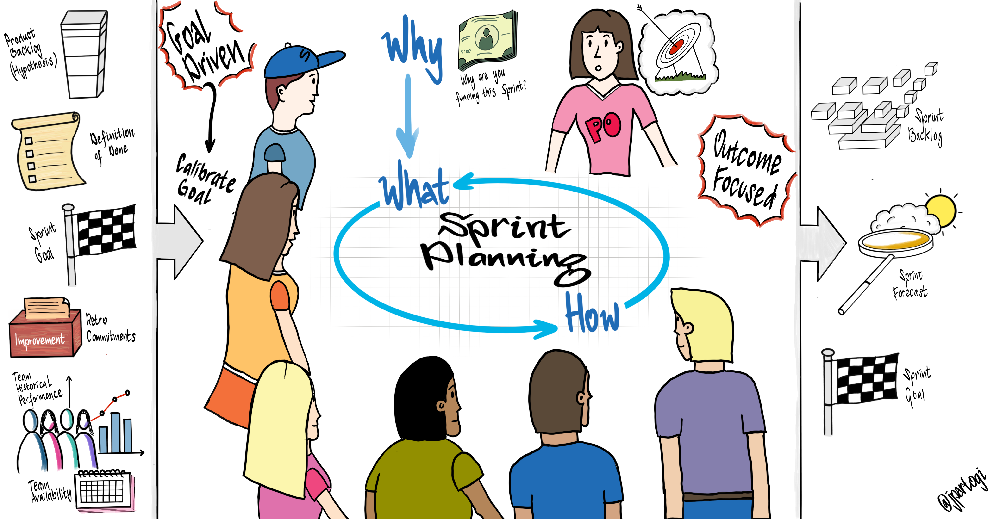

# Sprint 계획

### INTRO.

Sprint에서 수행되어야 할 작업을 Sprint Planning(스프린트 계획) 미팅에서 정한다. 이 계획은 전체 Scrum 팀의 공동 작업으로 만들어진다.

Sprint Planning은 1개월 Sprint를 기준으로 최대 8시간을 제안하고, 더 짧은 Sprint를 위해서는 보통 더 짧은 Sprint Planning 미팅을 진행한다.

SM은 팀이 Sprint Planning 미팅을 했는지, 모든 참여자가 그 목적을 제대로 이해했는지 확인해야 하고, Sprint Planning 미팅이 주어진 시간 안에 끝나도록 Scrum 팀을 교육한다.

Sprint Planning 미팅에서는 다음의 2가지 질문에 대한 답을 논의해야 한다.

- 이번 Sprint에서 무엇을 할 수 있는가?
- 선택된 작업을 어떻게 완료하나?

### Topic 1: 이번 Sprint에서 무엇을 할 수 있는가? (What)

개발팀은 Sprint 동안 개발할 수 있는 기능을 예상하고, PO는 Sprint에서 달성해야 할 목표와 그 목표 달성을 위해 Sprint에서 완료해야 할 Product Backlog 항목에 대해 개뱔팀과 토론하여, 팀 전체가 Sprint에서 해야 할 작업을 더 잘 이해할 수 있도록 서로 협력한다.

Sprint Planning 미팅을 시작하기 위해 Product Backlog, 가장 최근의 Product Increments, Sprint 동안의 개발팀 가용 인력 예상, 개발팀의 과거 생산성 자료를 준비한다.

Sprint에서 개발할 Sprint Backlog 항목 수는 전적으로 개발팀이 결정한다. Sprint 동안 개발팀이 무엇을 얼마나 해낼 수 있는지는 개발팀 스스로만 평가할 수 있다.

개발팀이 이번 Sprint 완료할 Product Backlog 항목을 정한 다음에는 전체 Scrum 팀이 Sprint 동안 달성하고자 하는 목표를 정한다.

### Topic 2: 선택된 작업을 어떻게 완료하나? (How)

Sprint 목표를 정하고 Sprint에서 수행할 Product Backlog 항목을 선택한 후, 개발팀은 이번 Sprint에서 이 기능들을 어떻게 “완료”된 Product Increments로 구현할지 결정한다.

개발팀은 일반적으로 Product Backlog를 작동하는 Product Increments로 만드는 데 필요한 시스템과 작업을 설계하는 것부터 시작한다. 개발팀은 다음 Sprint에서 수행할 수 있다고 생각되는 것들을 예측하여 Sprint Planning 미팅에서 충분한 양의 작업을 계획한다.

미팅을 마치기 전에 개발팀은 Sprint 첫날에 작업할 일들을 하루 혹은 그 미만의 시간 단위로 계획한다.

개발팀은 Sprint Planning 미팅 동안 그리고 Sprint 진행 중 Sprint Backlog의 작업을 각자 맡아 수행하도록 자율적으로 조직, 운영한다. PO는 Sprint에 선택된 Product Backlog 항목들을 명확히 하고, 절충안(Trade-Off)을 찾는데 도움을 줄 수 있다.

작업량이 너무 많거나 너무 적을 경우, 개발팀은 PO와 Product Backlog 항목들을 재협상할 수 있다. 개발팀은 기술이나 전문 지식에 대한 조언을 얻기 위해 다른 사람들을 미팅에 초대할 수도 있다.

Sprint Planning 미팅이 끝나기 전에, 개발팀은 자기 조직적인 팀으로서 Sprint 목표를 달성하기 위해 어떻게 작업할 것이고 어떻게 예상되는 Product Increments를 만들어 낼 것인지 PO와 SM에게 설명할 수 있어야 한다.

### Sprint Backlog

Sprint에서 선택된 Product Backlog 항목과 그것들을 완료하여 배포하기 위한 계획을 합쳐 Sprint Backlog라 한다.

### Sprint 목표

Sprint 목표는 Product Backlog 항목을 개발함으로써 이루어질 수 있다. Sprint 목표는 개발팀이 왜 Product Increments를 만들고 있는지에 대한 가이드를 제공한다.

Sprint 목표는 Sprint Planning 미팅에서 정한다. Sprint 목표는 개발팀에게 Sprint에서 개발할 기능에 대하여 약간의 유연성을 제공한다.

선택된 Product Backlog 항목들은 하나의 일관된 기능이 되고, 이것이 Sprint 목표가 될 수 있다.

Sprint 목표는 개발팀이 개별적으로 일하지 않고 함께 일할 수 있도록 묶어주는 역할을 한다.

개발팀은 작업을 진행하면서 Sprint 목표를 늘 염두에 두어야 한다.

Sprint 목표를 달성하기 위해 개발팀은 기능과 기술을 구현한다.

Sprint 진행중, 만약 그 작업이 개발팀이 예상했던 것과 다른 경우, 개발팀은 이번 Sprint에서 진행하기로 했던 Sprint Backlog를 PO와 재협상 한다.

### STEPS

|   참가자    |            타임박스            |                            산출물                            |
| :---------: | :----------------------------: | :----------------------------------------------------------: |
| **팀 전원** | **4시간** (2주 Sprint 기준) | **Sprint 목표** **[Sprint Backlog](./sprint-backlog.md)** **[Velocity Chart](./chart.md)** **[Burndown Chart](./chart.md)** (DoR/DoD) |

  #### STEP 1: Product Backlog 정제

  - 지난 Sprint에서 추가, 변경된 Story 들을 Product Backlog에 반영하여 현행화 합니다.
  - PO는 Product Backlog의 우선순위를 점검하여 최종 의사결정 합니다.
  - 개발팀은 Product Backlog에서 Story 추정이 안되어 있는 Story를 추정합니다.
    - Story 추정을 위해서 질문과 논의를 통해 범위와 내용을 확인
    - Story Point 변경이 필요한 기존 Story도 재추정

  #### STEP 2: DoR/DoD 정제 (선택사항)

  - 팀원들이 모두 함께 DoR과 DoD를 점검하고 갱신합니다.

  #### STEP 3: Velocity 계산

  - 지난 Sprint의 Velocity를 계산합니다.
    - 지난 Sprint에서 완료한 Story Point 총합
  - 지난 3번 Sprint의 Velocity 평균값도 계산합니다. (선택사항)
    - 이 값을 팀의 실제 Velocity로 사용

  #### STEP 4: Sprint 목표 초안 작성

  - PO는 개발팀과 논의하여 이번 Sprint에서 달성해야 할 목표의 초안을 작성합니다.
    - Sprint 목표는 간략한 문장으로 표현

  #### STEP 5: Story 선정

  - 개발팀은 서로 논의하여 이번 Sprint에서 작업할 Story를 선정합니다.
    - Sprint 목표에 부합하는 우선순위가 높은 Story 선정
    - Velocity를 고려하여 무리하지 않는 범위 내에서 선정

  #### STEP 6: Task 도출

  - 개발팀은 선정된 Story의 기능 범위와 구현 방법에 대해 논의합니다.
    - 기능 범위는 PO가 의사결정
  - 개발팀은 해당 Story를 구현하기 위해 필요한 세부 Task를 도출합니다.
  - 개발팀은 각 Task의 작업 시간을 추정하여 기록합니다. (선택사항)
  - 선정된 모든 Story에 대해 같은 작업을 반복합니다.

  #### STEP 7: 작업 당당자 선정

  - 각 Story 혹은 각 Task의 작업 담당자를 선정합니다.
    - 선정된 담당자는 카드에 기록

  #### STEP 8: Sprint 목표 확정

  - Sprint 목표 초안과 선정된 Story 들을 확인하여 최종 Sprint 목표를 확정합니다.

  #### STEP 9: Scrum 보드 및 Chart 갱신

  - Sprint 목표를 Scrum 보드에 게시합니다.
  - Sprint Backlog를 Scrum 보드의 Todo에 게시합니다.
    - Todo의 좌측에 Story를 세로로 나열하고, 해당 Story에 옆에 가로로 Task 나열
  - 새로운 Burndown Chart를 게시합니다.
  - Velocity Chart를 갱신합니다.
    - 지난 Sprint의 Velocity 기록
    - 지난 3번 Sprint의 Velocity 평균값 기록 (선택사항)
    - 이번 Sprint에서 약속한 Story Point의 총합 기록 (선택사항)

  ### PROTIP

  - Product Backlog 정제는 Sprint 진행중 일정 시간을 할당하여 주기적으로 수행할 수도 있습니다. 다만, Sprint 계획하기 직전에는 현행화되어 있어야 합니다.

  - Product Backlog를 정제하는데 소요되는 시간은 팀의 전체 가용 시간의 10%를 초과하지 않도록 합니다.

  - 팀의 Velocity를 고려하여 현실적으로 가능한 수준으로 Sprint Backlog를 계획합니다.

  - 각 작업의 역할이 분명히 나뉘어 있는 경우, 그 인원의 가용 시간을 고려합니다.

  - Sprint Backlog는 개발팀의 합의를 통해 스스로 선정합니다. (PO는 Sprint 목표와 우선순위만 정함)

  - Story의 Task 도출시 가능한 한 작은 단위로 작업들을 세분화합니다 (하루 전후 정도의 작업 크기)

  - Task의 Story Point 추정은 권장하지 않습니다. 해야 한다면 작업 시간으로 추정합니다.

  - 작업 담당자는 자발적으로 선택합니다.

### REFERENCE

  - **[Product Backlog](./product-backlog.md)**
  - **[Sprint Backlog](./sprint-backlog.md)**
  - **[Chart](./chart.md)**

