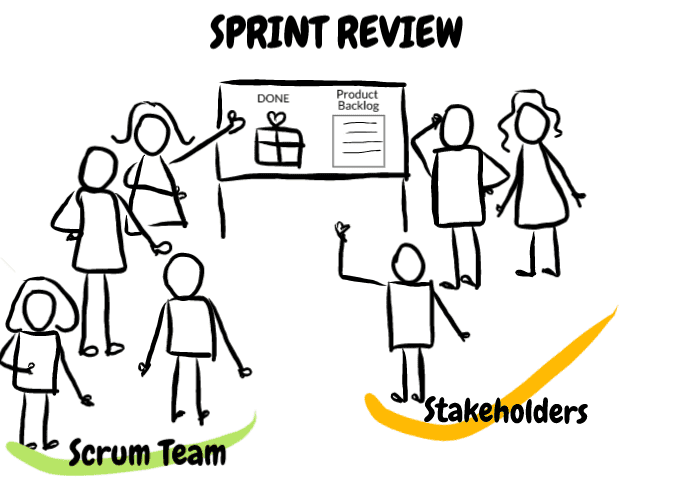

# Sprint 리뷰하기

### INTRO.

Sprint Review(스프린트 리뷰)는 Product Increments를 검토하고, 필요에 따라 Product Backlog를 적합하게 수정하고자 매 Sprint 끝에 수행한다.

Sprint Review에서 Scrum 팀과 제품 이해관계자들은 이번 Sprint에서 무엇이 완료 되었는지에 대해 함께 확인한다.

Sprint Review 결과와 Sprint 수행 중 변경된 Product Backlog를 고려하여, 미팅 참석자들은 제품 가치를 최적화하기 위해 다음에 무엇을 해야 할지 함께 의논한다.

Sprint Review는 비공식 미팅으로, 경과 보고 미팅이 아니고 완료된 Product Increments를 발표함으로 피드백을 얻고 서로 간의 협력을 촉진하기 위한 미팅이다.

Sprint Review는 1개월 Sprint 기준으로 최대 4시간을 제안한다. 더 짧은 Sprint에서는 더 짧은 Sprint Review 미팅을 한다.

SM은 팀이 Sprint Review 미팅을 했는지, 모든 참석자가 그 목적을 제대로 이해했는지 확인해야 하고, Sprint Review 미팅이 주어진 시간 안에 끝나도록 Scrum 팀을 교육한다.

### 주요 내용

Sprint Review는 다음의 내용을 포함한다.

- 미팅에는 Scrum 팀과 PO가 초대한 핵심 제품 이해관계자들이 참석
- PO가 완료된 Product Backlog 항목과 완료되지 못한 항목을 설명
- 개발팀은 Sprint 동안 무엇이 잘 진행되었는지, 무슨 문제가 있었는지, 어떻게 문제들을 해결했는지 설명
- 개발팀은 완료된 작업을 시연하고 그 Product Increments에 대한 질문에 답변
- PO는 현재 남아 있는 Product Backlog를 설명하고, (필요하다면) 현재까지의 진행 상황을 바탕으로 가능한 예상 목표 및 제품 전달 날짜를 계획
- 참가자 전체가 다음에 무엇을 할지 함께 의논하여 다음 Sprint Planning에 가치 있는 조언을 제공
- 제품의 시장이나 잠재적 사용처가 어떻게 변했는지 그리고 다음에 해야 할 가장 가치 있는 일들은 무엇인지 검토
- 다음 제품 출시 기능이나 성능에 대한 일정, 예산, 잠재적 기능, 그리고 시장에 대해 검토

Sprint Review 결과는 다음 Sprint에서 진행해야 할 Product Backlog를 재구성하기 위한 것이다.

Sprint Review를 통해 얻은 피드백은 추후에 논의를 통해 반영 여부와 방법을 결정하여 Product Backlog에 반영한다.

Product Backlog는 새로운 기회를 위해 전체적으로 조정될 수 있다.

### Sprint 리뷰 vs. Sprint 회고

- Sprint 리뷰는 Sprint 수행 후 실제 배포 가능한 Product Increments를 이해관계자에게 데모를 하고 피드백을 받는 활동
- Sprint 회고는 Sprint 결과물이 아니라 Sprint 수행 프로세스를 대상으로 개선해야 할 사항을 식별하고 이에 대한 개선안을 도출하는 활동

### STEPS

|   참가자    |             타임박스             |                산출물                |
| :---------: | :------------------------------: | :----------------------------------: |
| **팀 전원** | **2시간** (2주 Sprint 기준) | **제품 피드백** **제품 개선안** |

#### STEP 1: 리뷰 준비

- 리뷰 날짜, 시간, 장소를 정하고, 리뷰 참가자를 선정하여 이메일 등을 통해 사전에 공지합니다.
  - 참가자가 스케줄을 조정할 수 있도록 미리(약 1주일 전) 공지
- 리뷰를 진행할 진행자를 선정합니다.
  - PO를 대상으로 하는 리뷰에서는 개발팀의 대표 혹은 SM이 진행
  - 이해관계자를 대상으로 하는 리뷰에서는 PO가 진행
- 리뷰 진행 순서와 시간 계획을 수립합니다.
- 완료된 각 기능의 데모를 수행할 담당자를 정하고 데모를 준비합니다.
  - 데모 수행 환경 및 시나리오 준비
- 리뷰 진행시 피드백을 기록할 서기를 선정합니다.

#### STEP 2: Sprint 진행 현황 브리핑

- 진행자가 이번 Sprint의 진행 현황에 대해 간략하게 브리핑 합니다.
  - 이번 Sprint의 목표, 계획, 완료된 기능과 완료되지 못한 기능 및 사유, 이슈 사항과 처리 상황 등

#### STEP 3: 기능 데모

- 시연할 기능별 개발팀 담당자가 PO 및 이해관계자들에게 준비된 시나리오에 따라 기능을 시연합니다.

#### STEP 4: Q&A 및 피드백

- 시연한 기능에 대해 질문을 받고 답변합니다.
- 기능에 대한 피드백 등의 의견을 수집합니다.
  - 피드백은 서기가 따로 기록하여 보관

#### STEP 5: 과제 전체 진행 현황 브리핑 (선택사항)

- 이해관계자를 대상으로 하는 리뷰에서는 PO가 과제의 전체 진행 현황을 간략하게 브리핑 합니다.
  - 과제 로드맵, 진척 상황, 진행 일정, 다음 Sprint 계획 등

#### STEP 6: 리뷰 마무리

- 리뷰를 끝내고 팀원들만 참석하여 별도의 Wrap Up 시간을 가집니다.
- 과제의 진행방향을 점검합니다.
- 수집된 피드백에 대해 논의하고 개선안을 도출합니다.
- 개선안은 Product Backlog에 반영합니다.
  - 잠시 Parking Lot에 두었다가 이후의 Product Backlog 정제 시간에 반영할 수도 있음

### PROTIP

- Sprint 리뷰 준비를 위해 개인당 1시간 이상을 소모하지 않도록 합니다.
- Sprint 리뷰를 위해 가능하면 별도의 발표 자료를 만들지 않도록 합니다.
  - 동작하는 소프트웨어를 보여주는 것만으로도 충분
  - PO는 Sprint 및 과제 진행 현황을 공유하기 위해 별도의 발표 자료가 필요할 수도 있음
  - 가능하면 이미 있는 자료나 사진을 활용
- 이해관계자를 대상으로 하는 리뷰에서는 PO가 Sprint 리뷰를 진행합니다.
  - SM은 조용히 참여하여 전체적인 진행, 분위기, 의견 등을 관찰
- PO가 Sprint 리뷰를 통해 완료된 기능을 최종 인수하는 것이 아니라, 참석한 이해관계자들에게 데모를 주관하는 팀의 일원으로 참가하는 것을 권장합니다.
  - Story 인수는 Sprint 수행시 평소에 인수 테스트를 수행하고 피드백을 통해 기능이 진짜 완료될 수 있도록 함
- Sprint 리뷰 참석자들로부터 나온 새로운 기능이나 개선 요청 사항은 새로운 Product Backlog 항목으로 등록합니다.
- Sprint 리뷰에 꼭 있어야 하는 올바른 이해관계자를 초대합니다.

### REFERENCE

- **[Parking Lot](./parking-lot.md)**