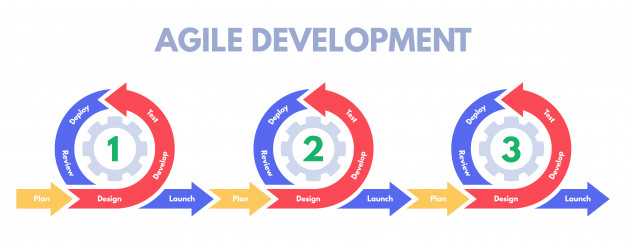

# Sprint

### 개요

Sprint는 Scrum의 핵심으로, 한 달 또는 그 미만의 정해진 시간 동안 계획한 기능들을 “완료”하여 사용할 수 있고 출시 가능한 “Product Increments(제품 증분)”으로 만들어 낸다.

Sprint는 일반적으로 전체 개발 기간에 변하지 않는 고정된 기간으로 진행된다. 새로운 Sprint는 그 이전 Sprint가 끝남과 동시에 시작된다.

Sprint는 다음과 같은 이벤트 미팅으로 구성된다.

- [**Sprint Planning**](./sprint-planning.md)
- [**Daily Scrum**](./daily-standup-meeting.md)
- [**Sprint Review**](./sprint-review.md)
- [**Sprint Retrospective**](./sprint-retro.md)

Sprint 동안에는,

- Sprint 목표를 이루는데 방해가 되는 어떠한 변경도 허용되지 않음
- 제품의 품질 목표를 낮추지 않음
- Sprint가 진행되면서 개발 범위에 대한 이해가 커짐에 따라, 개발팀은 PO와 함께 개발 범위를 명확히 하거나 재협상할 수 있음

각 Sprint는 한 달 미만의 프로젝트하고 할 수 있다. 프로젝트처럼 Sprint를 통해 무엇인가를 성취한다.

각 Sprint에는 무엇을 만들 것인지에 대한 목표, 그것을 만들기 위해 어떻게 설계하고 유연한 계획을 세워갈지, 그리고 작업 내용과 점진적인 결과 제품이 있어야 한다.

Sprint는 최대 한 달로 제한된다. Sprint 기간이 너무 길어지면 무엇을 만들어야 하는지에 대한 정의가 변하거나, 복잡도가 증가하거나, 위험이 증가할 수 있다.

Sprint는 적어도 매달의 진행 상황에 대한 검토와 적응을 보장하기 때문에 제품에 대한 예측이 가능하다. 또한, Sprint는 한 달 미만의 비용으로 위험을 제한할 수 있다.

### Sprint 주기

Sprint 길이는 팀의 업무 절차와 특성 등을 고려하여 1~4주 사이의 기간 내에서 가능한 짧은 주기로 정하는 것을 권장한다.

Sprint 주기가 너무 짧으면 업무를 마무리할 시간적 여유가 없을 수 있고, Sprint 길이가 너무 길면 피드백 주기가 길어져 변화에 민첩한 대응이 어려울 수 있다.

### Sprint 시간표

Sprint는 2주 길이의 Sprint 주기를 사용하는 시간표를 생각해 볼 수 있다.

Sprint 길이가 더 길거나 짧은 경우 그에 비례해서 활동 시간이 증가하거나 감소한다.

여기에 나온 시간은 꼭 그 만틈의 시간을 해야 하는 것이 아니라 활동을 수행하는 최대 시간 제한(Time-Box)으로 각 활동의 최대 시간을 넘기지 말아야 한다.

### Sprint 취소

Sprint는 Sprint 기간이 종료되기 전에 취소할 수 있다. 단, PO만이 Sprint를 취소할 권한을 가지고 있지만, PO가 이해관계자나 개발팀, 혹은 SM의 영향을 받아 Sprint 취소를 결정할 수도 있다.

만약 Sprint 목표가 더 이상 유효하지 않다면 Sprint가 취소될 수 있다. 이러한 상황은 회사가 추구하는 방향이 바뀌거나, 시장이나 기술의 상황이 바뀌었을 경우 발생할 수 있다.

일반적으로 주어진 상황에 Sprint가 더는 의미가 없어졌을 때 취소되어야 한다. 하지만 Sprint 기간이 짧은 것 때문에 취소하는 것은 사실상 거의 의미가 없다.

Sprint가 취소되면, 이미 완성되어 “완료”된 Product Backlog의 항목들을 검토한다.

만약 그 작업 결과물의 일부가 출시 가능한 상태이면, PO는 일반적으로 그것들을 수용하고 제품에 포함한다.

모든 미완료 상태의 Product Backlog 항목들은 재추정하여 Product Backlog 목록으로 다시 들어간다. 미완료된 Product Backlog 항목들을 위해 수행된 작업은 빠르게 쓸모 없어지므로 재추정을 자주 해주어야 한다.