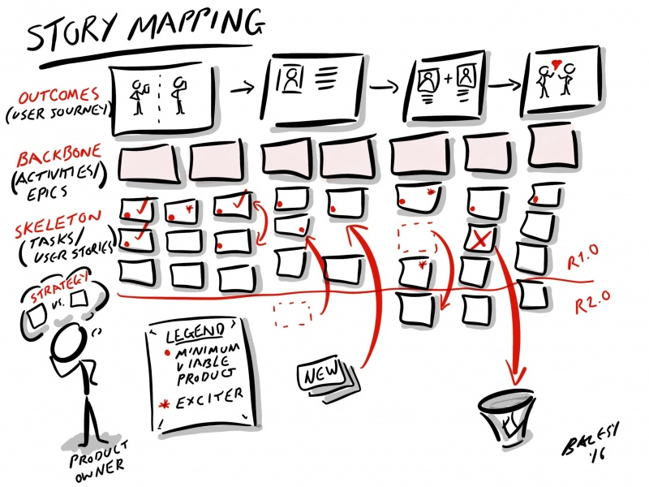
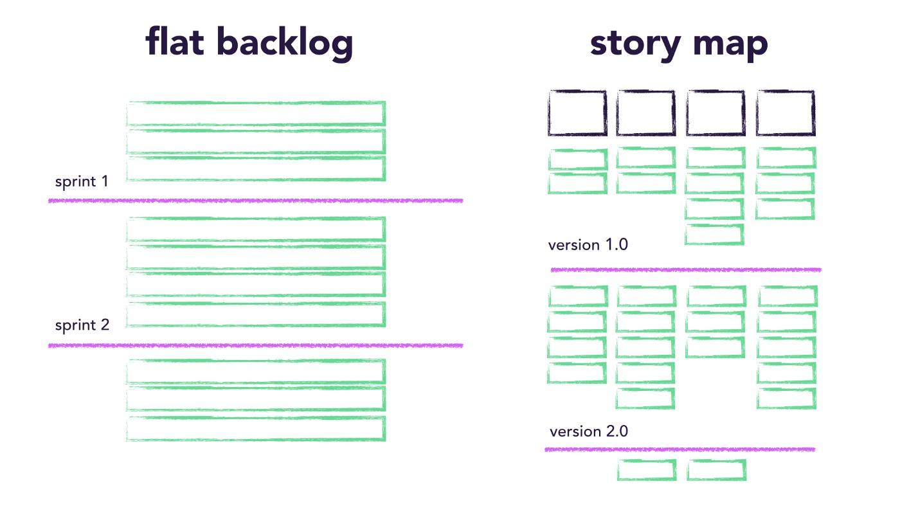
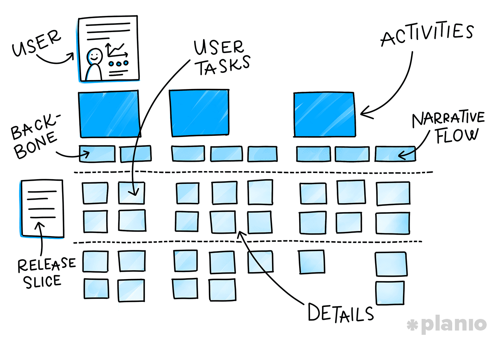
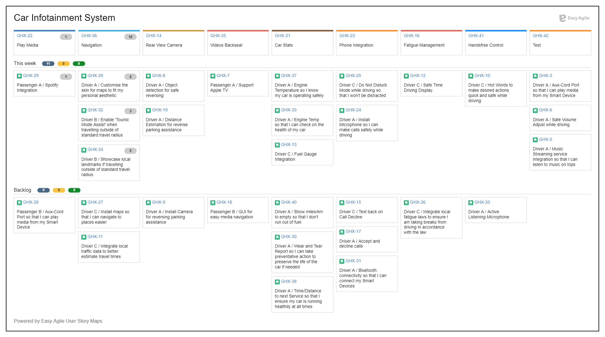
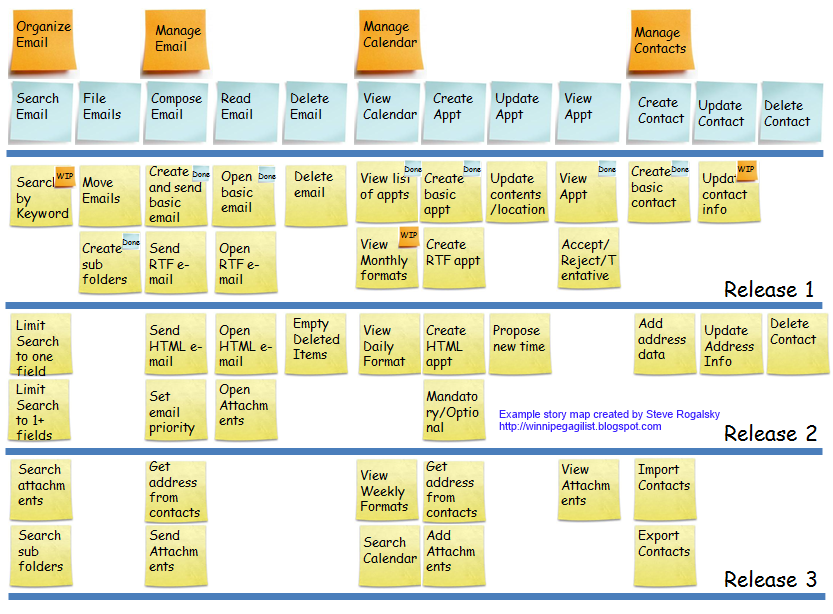

# Story Map

### 개요

"고개만 돌리면 눈앞에 펼쳐지는 제품의 빅픽쳐!"

Story Map은 Product Backlog를 도출하고 시각화하여 제품 기능의 구조화된 큰 그림을 제공한다.

Story Map은 팀원들 간의 대화를 유도하고 이해를 공유할 수 있는 가장 유용한 Product Backlog 관리 기술이다.

(그림: Story Mapping) (출처: http://www.agileme.com.au/wiki/Story_Mapping)

### Flat Backlog vs. Story Map

(그림: Flat Product Backlog vs. Story Map) (출처: https://blog.easyagile.com/the-difference-between-a-flat-product-backlog-and-a-user-story-map-93cff02f23a3)

### 구조

Story Map은 크게 3개의 부분으로 나뉜다.

- **User**: 제품/서비스를 사용하는 사용자 분류
- **Epic**: User가 제품/서비스를 사용하면서 수행하는 큰 활동
- **Story**: 각 Epic의 세부 활동(기능)

(그림: Story Map) (출처: https://plan.io/blog/user-story-mapping/)

### 작성 방법

- 제품 비전/목표 설정 (Vision, Goal)
- 제품 사용자 식별 (User, Persona)
- 제품 사용자의 상위 수준의 활동 도출 (Activity, Epic)
  - 주요 활동은 시간 연대(Narrative Flow) 순서로 생각하면 도출이 좀 더 용이해짐
  - 범위가 누락되지 않게 도출하는 것이 중요
- 주요 활동별 세부 활동(기능) 도출 (Story)

### 샘플

(그림: Story Map 샘플)

(그림: Story Map 샘플) (출처: https://www.barryovereem.com/the-user-story-mapping-game/)