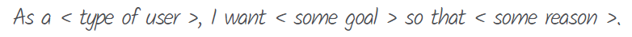
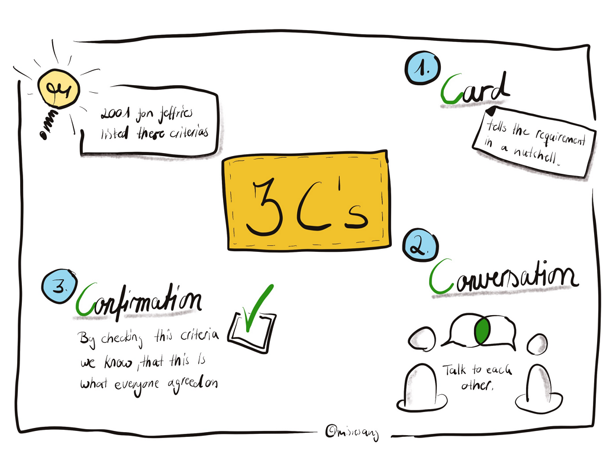

# 사용자스토리(User Story)

### 개요

User Story는 시스템과 상호작용하는 사용자의 관점에서 의미있는 가치를 짧고 간단한 설명으로 표현하는 요구사항 기술 방법이다.

### User Story 형식

User Story는 일반적으로 다음과 같은 형식으로 작성된다.

- **Who (누가)**: 사용자, Persona
- **What (무엇)**: Who가 원하는 기능(목표)
- **Why (왜)**: Who가 What을 원하는 이유(가치)

(그림: User Story 형식) (출처: https://www.mountaingoatsoftware.com/agile/user-stories)

### User Story의 의미 (3C's by Ron Jeffries)

User Story가 가지는 3가지 의미는 다음과 같다.

- **Card (카드)**: 포스트잇과 같은 작은 카드에 기술
- **Conversation (대화)**: 대화를 통해 세부사항 구체화
- **Confirmation (확인)**: Story 완료 기준(인수 조건, 테스트 케이스) 확인

(그림: User Story 3C's) (출처: https://www.wibas.com/blog/agile-myth-writing-user-stories-is-product-owner-work/)

### 좋은 User Story의 조건 (INVEST)

- **Independent** (독립적인): 서로 독립적으로 정의되어 가능한 한 다른 Story와 중복되지 않고 의존관계를 최소화해야 한다.
- **Negotiable** (협상 가능한): PO와 다음 Sprint를 진행하기 전에 협상할 여지가 있어야 한다.
- **Valuable** (가치 있는): 사용자, 고객에게 가치가 있어야 한다.
- **Estimable** (추정 가능한): 기능 범위가 명확하여 추정 가능해야 한다.
- **Small** (작은): 한 Sprint에서 완료가 가능할 정도로 충분히 작아야 한다.
- **Testable** (테스트 가능한): 기능 범위와 인수 조건이 명확하여 테스트 가능해야 한다.

### Story의 종류

- User Story: 사용자 관점의 기능
- Technical Story: 사용자에게 직접적인 가치를 제공하지는 않지만, 기술적으로 필요한 작업
  - 아키텍쳐/인프라, 리팩토링, 버그 수정, 스파이크(기술 검증, 연구, 학습 등)

### User Story 샘플

- 사용자로서, 나는 전체 하드디스크를 백업하고 싶다.
  - 파워 사용자로서, 나는 파일크기, 생성날짜, 수정날짜를 기준으로 백업할 파일 또는 폴더를 지정하고 싶다.
  - 일반 사용자로서, 나는 백업할 폴더를 선택하여 백업 드라이브에 불필요한 항목이 저장되지 않도록 하고 싶다.
- 운전기사로서, 나는 나쁜 승객을 차단하여 다시는 나타나지 않게 하고 싶다.
- 승객으로서, 나는 신용카드를 내 프로필에 등록하여 빠르고 쉽게 결재하고 싶다.
- 운전기사로서, 나는 더 많은 승객을 유치할 수 있도록 내 프로필에 나의 멋진 자동차 사진을 추가하고 싶다.
- 승객으로서, 나는 가장 마음에 드는 운전기사를 선택할 수 있도록 여러 운전기사 목록을 표시하고 싶다.
- 마케팅 담당으로서, 나는 과거 광고 캠페인의 실적을 검토할 때 사용할 휴가 시즌을 선택하여 수익성 있는 캠페인을 식별하고 싶다.
  - 휴일을 지정할 수 있다. (크리스마스, 부처님오신날, 어린이날, 어버이날, 근로자의날, 설날, 추석)
  - 2년간의 휴일을 지원한다. (3년 이상은 지원 안함)
  - 휴일 시즌은 휴일 전 며칠로 설정할 수 있다.
- 앱 사용자로서, 나는 내가 얼마나 멋진지 알리기 위해 프로필 사진을 등록하고 싶다.
- 앱 관리자로서, 나는 누드 프로필로 사람들을 놀라게 하거나 커뮤니티 규칙을 위반하지 않도록 앱 사용자의 프로필 사진을 차단/삭제하고 싶다.
- 앱 사용자로서, 나는 강남 한복판에 있는 내 펜트하우스가 아닌 인간적인 장점을 알리기 위해 프로필에 별도의 추가 정보를 입력하고 싶다.

### Reference

- **[User Story Mapping](./user-story-map.md)**
- **[Story Card Template](./template/story-card-template.md)**
- **[추정하기](./estimation.md)**

